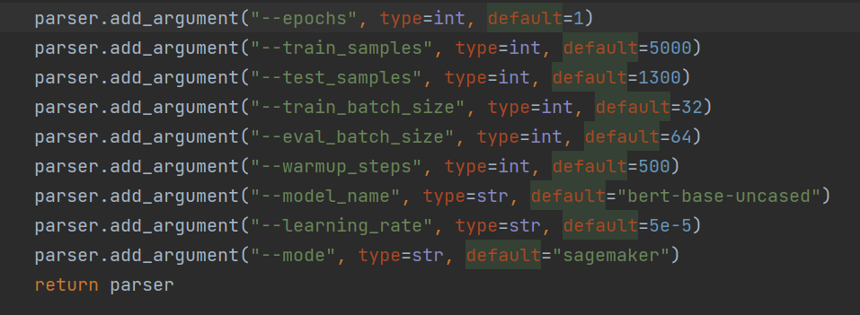
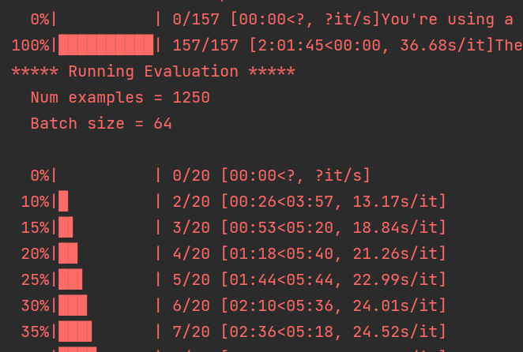
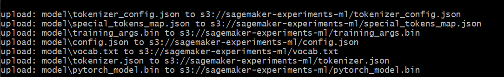

### Hugging Face on Sagemaker

This section follows the steps in the tutorial on the Hugging Face docs to
run preprocessing, training and inference jobs.
https://huggingface.co/docs/sagemaker/train#run-training-on-amazon-sagemaker

### Sagemaker roles

If you have created Sagemaker roles previosuly, you can list
them out on the console, filtering the output for roles with sagemaker service
principal in assumed role policy.
In my case, I have roles created for SagemakerNotebook and Sagemaker Main Role

```
 aws iam list-roles --query 'Roles[?AssumeRolePolicyDocument.Statement[0].Principal.Service==`sagemaker.amazonaws.com`].Arn'
```


To get more details on the attached policies for the SagemakerMainRole.


### Running the steps

Run the preprocess.py script to download and preprocess  (tokenise) the IMDB
dataset for training.
This also uploads the preprocessed dataset to the S3 BUCKET.


The training_job.py script creates a Hugging Face Estimator to handle end-to-end SageMaker
training. This uses a finetuning script in the scripts/train.py which is taken from
https://github.com/huggingface/notebooks/blob/main/sagemaker/01_getting_started_pytorch/scripts/train.py

The training job starts by creating the instances for training, downloading the ECR hugging face image uri specified
and fetching the training and test datasets from S3 for training and evaluation of metrics.

We can fetch details of the training job from cli. We can filter by create date as below.

aws sagemaker list-training-jobs --query 'TrainingJobSummaries[?CreationTime>`2023-01-01`]'


Once the training job is complete, the model should be persisted to S3. Run the `predict.py` script to downaload
the fine-tuned model from S3 and deploy to a Sagemaker endpoint by providing the name of the instance type and
number of instances to run the endpoint.

The script also sends an example request to the endpoint for generating a prediction.
Finally, the endpoint is deleted by calling `predictor.delete_endpoint(<Endpoint-Name>)`


### Running the train.py script locally

To train the Hugging Face model locally, we can run the script with the local value for the --mode arg.
In Pycharm, configurations add the `--mode local` to the parameters and we will also need to add
env variables for the `ACCESS_KEY_ID` and `SECRET_ACCESS_KEY` as the script will need to download data
from the S3 bucket using aws credentials.

The code sets the following defaults via argparse, which can be overriden from the command line or via the
Pycharm parameters in the configuration.



Depending on machine specs, an example run is shown below which took 2 hours on an NVIDIA RTX 3080 graphics card, 64GB RAM, AMD Ryzen 9 5950X
16 core processor, using the default hyperparam settings on a sampled training size of 5000 examples and test
size of 1300 samples with the default learning rate.




The outputs (eval results and model artifact and metadata) should all be stored in the `scripts/output` and `scripts/model`
folders respectively.
These can then be uploaded to S3 for running the prediction workflow i.e. deploying the model to sagemaker endpoint for
serving real time requests.

```
aws s3 cp model s3://sagemaker-experiments-ml --recursive
```


